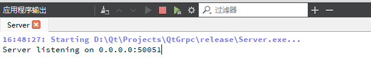
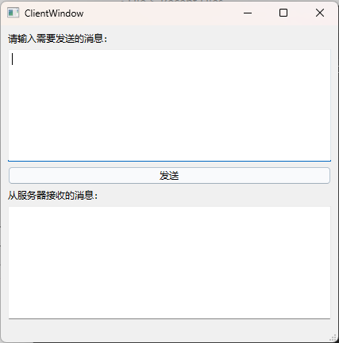
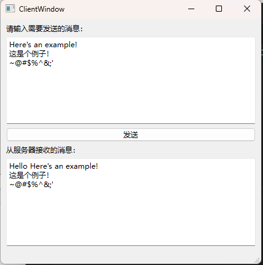
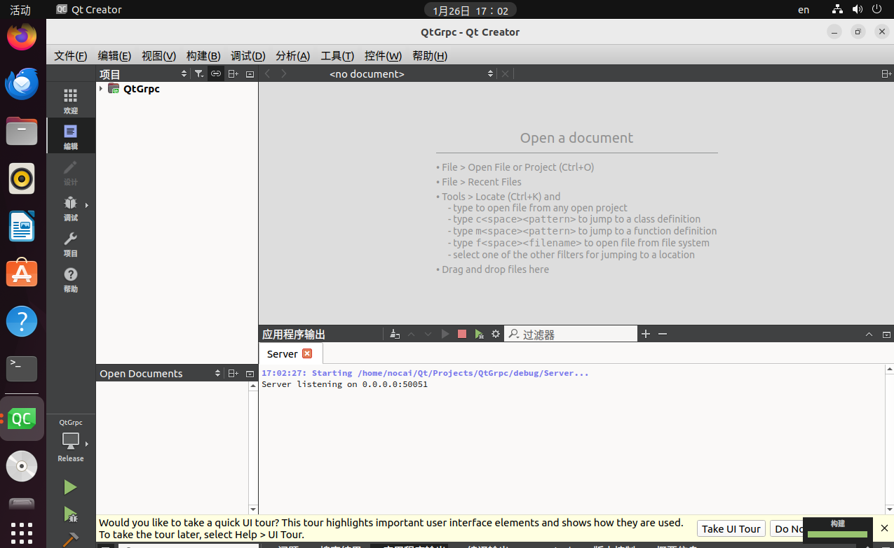
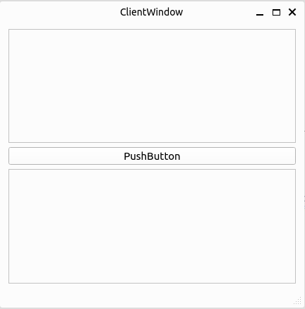
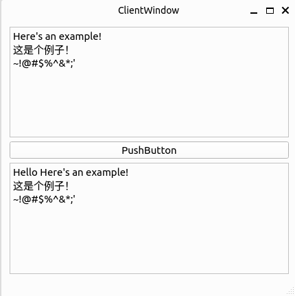

# QtGrpc
该项目为Qt使用gRPC的案例

## 特性
1. 从编译到使用有详细文档
2. 客户端和服务端使用gRPC进行通信

## 效果图
### Windows
1. 服务端

2. 客户端

### Linux
1. 服务端

2. 客户端

## 环境
### Windows
1. Qt Creator 12.0.1 (Community)
2. Qt 6.6.1
3. NASM 2.16.01
4. Windows SDK 10.0.20348.0
5. MSVC 2019 64bit
6. CMake 3.27.7
7. Ninja 1.10.2

### Linux
1. Qt Creator 12.0.1 (Community)
2. Qt 6.6.1
3. GCC 11.4.0 64bit
4. CMake 3.27.7
5. Ninja 1.10.2

## 目录结构

1. Client：客户端源码
2. Server：服务端源码
3. proto：gRPC的协议文件
4. gRPC_install：gRPC在Windows/Linux环境debug/release下编译好的库文件（由于过大，需要在Releases下载）
5. debug：调试模式下的输出
6. release：发布模式下的输出
7. doc：gRPC从编译到使用的详细文档
8. README_Figs：README.md使用的图

## 使用
1. 下载Releases中的库文件，并放入根目录（或者下载[gRPC源码](https://github.com/grpc/grpc)，参考[gRPC官方文档](https://grpc.io/docs/languages/cpp/quickstart/)，或参考[鄙人的文档](/doc/gRPC_Compile_Tutorial/gRPC_Compile_Tutorial.md "鄙人的文档")）
2. 根据自己的路径，通过.pri文件进行引入
3. 编写.proto文件，自定义协议
4. 根据doc文件夹中的Windows文档[Windows文档](/doc/gRPC_Tutorial_Winodws/Generating_C_Code_Using_Proto_File/Generating_C_Code_Using_Proto_File.md "Windows文档")/[Linux文档](/doc/gRPC_Tutorial_Linux/Generating_C_Code_Using_Proto_File/Generating_C_Code_Using_Proto_File.md "Linux文档")进行C代码生成
5. 在项目中引用生成的代码，如：[Windows引用](/doc/gRPC_Tutorial_Winodws/Qt_Using_gRPC_Tutorial/Importing_gRPC/Importing_gRPC.md "Windows引用")/[Linux引用](/doc/gRPC_Tutorial_Linux/Qt_Using_gRPC_Tutorial/Importing_gRPC/Importing_gRPC.md "Linux引用")进行C代码生成
6. 参考[官方例子](https://github.com/grpc/grpc/tree/master/examples/cpp)进行使用