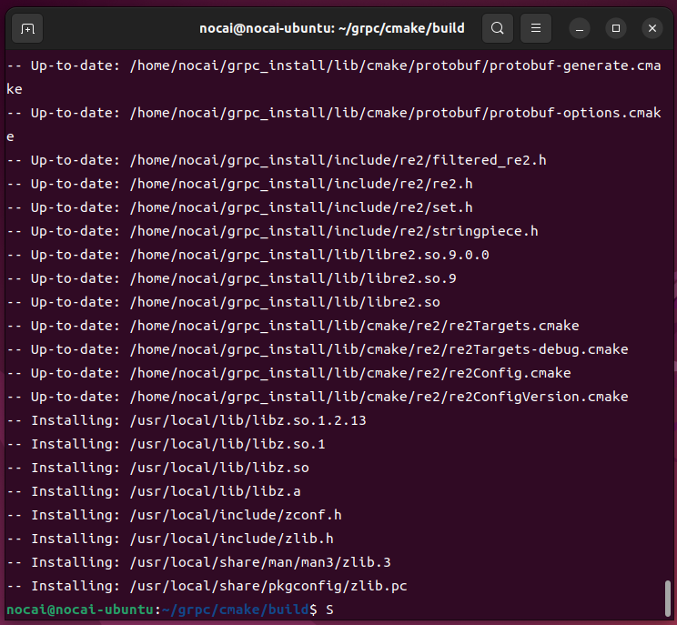

# gRPC编译

## 目录

-   [！！！！！！！！注意！！！！！！！](#注意)
-   [1. Windows](#1-Windows)
    -   [    1.1 从github克隆源码](#----11-从github克隆源码)
    -   [    1.2 安装NASM](#----12-安装NASM)
    -   [    1.3 打开项目](#----13-打开项目)
    -   [    1.4 构建（build）](#----14-构建build)
    -   [    1.5 部署（install）](#----15-部署install)
    -   [1.6 文件copy](#16-文件copy)
    -   [1.7 提取有用文件](#17-提取有用文件)
-   [2. Linux(Unbuntu 22.04)](#2-LinuxUnbuntu-2204)
    -   [2.1 准备工作](#21-准备工作)
    -   [2.2 从github克隆源码](#22-从github克隆源码)
    -   [2.3 构建（build）and部署（install）](#23-构建buildand部署install)
        -   [2.3.1 debug（可能要用sudo）](#231-debug可能要用sudo)
        -   [2.3.1 debug](#231-debug)
    -   [2.4 编译完的目录结构](#24-编译完的目录结构)

# ！！！！！！！！注意！！！！！！！

在debug下build、install后，把文件copy出来，整个流程走完再切到release下！！

# 1. Windows

## &#x20;   1.1 从github克隆源码

```纯文本
git clone --recurse-submodules -b v1.60.0 --depth 1 --shallow-submodules https://github.com/grpc/grpc
```

## &#x20;   1.2 安装NASM

&#x20;   参考安装教程

```纯文本
https://blog.csdn.net/sanqima/article/details/132526865
```

&#x20;   下载地址

```纯文本
https://www.nasm.us/pub/nasm/releasebuilds/2.16.01/win64/
```

## &#x20;   1.3 打开项目

&#x20;   使用Qt Creator打开grpc根目录下的CMakeLists.txt，拖拽进去即可，选择MSVC2019，等待配置


## &#x20;   1.4 构建（build）

&#x20;   需要保证Windows SDK版本大于或者等于10.0.20348.0

&#x20;   右键项目 → 构建 &#x20;

&#x20;   Release和Debug都build一下

## &#x20;   1.5 部署（install）

&#x20;   添加install指令


&#x20;   右键项目 → 部署

&#x20;   Release和Debug都install一下

&#x20;   会在C:\Program Files (x86)\grpc进行生成，两者都是相同路径，因此需要及时copy


## 1.6 文件copy

&#x20;   将C:\Program Files (x86)下的grpc文件夹，分别copy至需要的地方，重命名为debug/release


## 1.7 提取有用文件

&#x20;   可以不删除，将1.6原始两个文件夹移位

A. 将bin文件的.dll剪切至lib

B. 将lib中的文件夹删除，仅保留.dll和.lib

C. 删除cmake文件夹和share文件夹


bin：gRPC工具

include：头文件

lib：库文件

# 2. Linux(Unbuntu 22.04)

## 2.1 准备工作

&#x20;   在环境变量中定义install的文件夹

```纯文本
vim ~/.bashrc
export MY_INSTALL_DIR=/home/nocai/grpc_install
source ~/.bashrc
```

&#x20;   创建install文件夹

```纯文本
mkdir -p $MY_INSTALL_DIR
```

&#x20;   添加环境变量

```纯文本
vim ~/.bashrc
export PATH="$MY_INSTALL_DIR/bin:$PATH"
source ~/.bashrc
```

&#x20;   确保有cmake

```纯文本
cmake --version
```

安装grpc编译所需要的包

```纯文本
sudo apt install -y build-essential autoconf libtool pkg-config
```

## 2.2 从github克隆源码

```纯文本
git clone --recurse-submodules -b v1.60.0 --depth 1 --shallow-submodules https://github.com/grpc/grpc
```

## 2.3 构建（build）and部署（install）

```纯文本
cd grpc
mkdir -p cmake/build
pushd cmake/build

```

### 2.3.1 debug（可能要用sudo）

```纯文本
cmake -DgRPC_INSTALL=ON -DCMAKE_BUILD_TYPE=Debug -DgRPC_BUILD_TESTS=OFF -DCMAKE_INSTALL_PREFIX=$MY_INSTALL_DIR ../..
```


```纯文本
make

```


```纯文本
sudo make install
```



### 2.3.2 release

```纯文本
cmake -DgRPC_INSTALL=ON -DCMAKE_BUILD_TYPE=Release -DgRPC_BUILD_TESTS=OFF -DCMAKE_INSTALL_PREFIX=$MY_INSTALL_DIR ../..
```


```纯文本
make

```


```纯文本
sudo make install
```


## 2.4 编译完的目录结构


