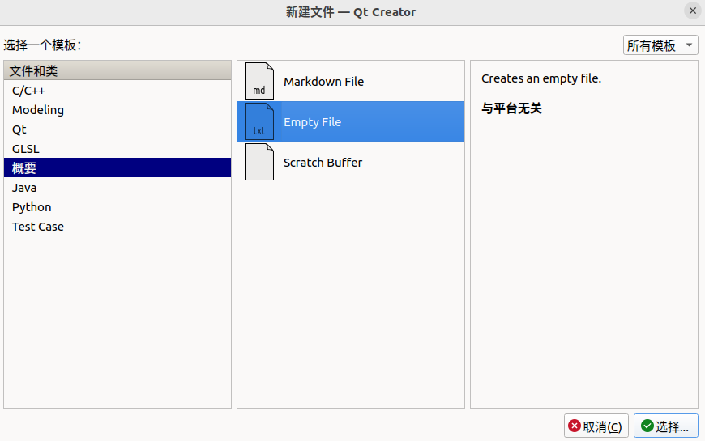
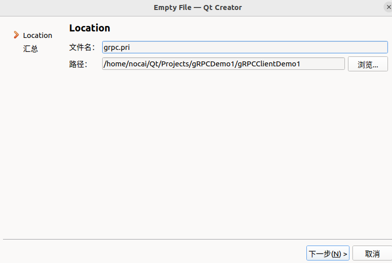
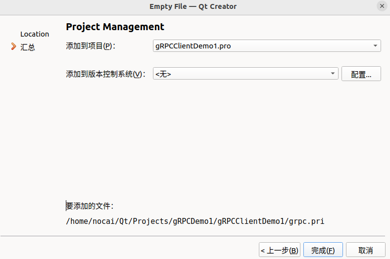
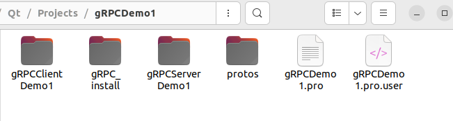
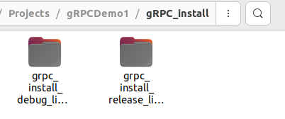
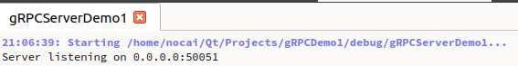
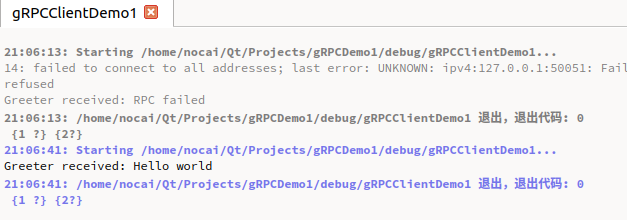

# 导入gRPC库

## 目录

-   [1. 客户端Client/服务端Server](#1-客户端Client服务端Server)
    -   [1.1 新建.pri文件](#11-新建pri文件)
    -   [1.2 编写.pri配置](#12-编写pri配置)
        -   [1.2.1 设置debug和release的输出目录](#121-设置debug和release的输出目录)
        -   [1.2.2 将grpc\_install复制到根目录下](#122-将grpc_install复制到根目录下)
        -   [1.2.3 引入gRPC头文件](#123-引入gRPC头文件)
        -   [1.2.4 引入gRPC静态库](#124-引入gRPC静态库)
        -   [1.2.5 踩坑](#125-踩坑)
        -   [1.2.6 文件总览](#126-文件总览)
    -   [1.3 使用helloworld例子](#13-使用helloworld例子)
        -   [1.3.1 Client](#131-Client)
        -   [1.3.2 Server](#132-Server)
        -   [1.3.3 结果](#133-结果)

# 1. 客户端Client/服务端Server

## 1.1 新建.pri文件







在gRPCClientDemo1.pro中引入新建的grpc.pri文件，并删除默认在DISTFILES下生成的语句

## 1.2 编写.pri配置

### 1.2.1 设置debug和release的输出目录

```纯文本
CONFIG(debug,debug|release){
    DESTDIR += $$PWD/../debug
}else{
    DESTDIR += $$PWD/../release
}
```

### 1.2.2 将grpc\_install复制到根目录下

&#x20;   将grpc\_install中的所有文件复制到项目的根目录下





### 1.2.3 引入gRPC头文件

```纯文本
INCLUDEPATH += $$PWD/../gRPC_install/grpc_install_debug_linux/include

```

### 1.2.4 引入gRPC静态库

注意，只引入以.so和.a结尾的

```纯文本
LIBS += -L$$PWD/../debug -labsl_bad_any_cast_impl
```

-L后面跟路径

-l后面跟文件名，不要后缀

小技巧：

&#x20;   由于静态库数量十分庞大，将文件名提取到.txt文件中，然后copy过去

&#x20;   在静态库文件夹debug下打开cmd，并输入

```纯文本
find . -name "*.so" -o -name "*.a" | sort > 1.txt

```

同理，在release下引入release的静态库，复制debug的即可，改一下路径，需要注意，debug和release的静态库略有差异

```纯文本
LIBS += -L$$PWD/../release -labsl_bad_any_cast_impl
```

注意：去掉开头的lib和结尾的.lib

### 1.2.5 踩坑

在使用debug的静态库时，会有几个动态库混入其中，导致程序不能运行，需将其删除，如下：

```纯文本
zlib.lib
zlibstatic.lib
libprotoc.lib
libprotobuf.lib  尤其是这个
libprotobuf-lite.lib 尤其是这个

```

同理，release下删除上述对应的debug版，如下：

```纯文本
zlibd.lib
zlibstaticd.lib
libprotocd.lib
libprotobufd.lib
libprotobuf-lited.lib

```

### 1.2.6 文件总览

```纯文本
.pri
unix{
    CONFIG(debug,debug|release){
        DESTDIR += $$PWD/../debug
        INCLUDEPATH += $$PWD/../gRPC_install/grpc_install_debug_linux/include

        LIBS += -L$$PWD/../gRPC_install/grpc_install_debug_linux/lib -labsl_bad_any_cast_impl
        LIBS += -L$$PWD/../gRPC_install/grpc_install_debug_linux/lib -labsl_bad_optional_access
        LIBS += -L$$PWD/../gRPC_install/grpc_install_debug_linux/lib -labsl_bad_variant_access
        LIBS += -L$$PWD/../gRPC_install/grpc_install_debug_linux/lib -labsl_base
        LIBS += -L$$PWD/../gRPC_install/grpc_install_debug_linux/lib -labsl_city
        LIBS += -L$$PWD/../gRPC_install/grpc_install_debug_linux/lib -labsl_civil_time
        LIBS += -L$$PWD/../gRPC_install/grpc_install_debug_linux/lib -labsl_cord
        LIBS += -L$$PWD/../gRPC_install/grpc_install_debug_linux/lib -labsl_cordz_functions
        LIBS += -L$$PWD/../gRPC_install/grpc_install_debug_linux/lib -labsl_cordz_handle
        LIBS += -L$$PWD/../gRPC_install/grpc_install_debug_linux/lib -labsl_cordz_info
        LIBS += -L$$PWD/../gRPC_install/grpc_install_debug_linux/lib -labsl_cordz_sample_token
        LIBS += -L$$PWD/../gRPC_install/grpc_install_debug_linux/lib -labsl_cord_internal
        LIBS += -L$$PWD/../gRPC_install/grpc_install_debug_linux/lib -labsl_crc32c
        LIBS += -L$$PWD/../gRPC_install/grpc_install_debug_linux/lib -labsl_crc_cord_state
        LIBS += -L$$PWD/../gRPC_install/grpc_install_debug_linux/lib -labsl_crc_cpu_detect
        LIBS += -L$$PWD/../gRPC_install/grpc_install_debug_linux/lib -labsl_crc_internal
        LIBS += -L$$PWD/../gRPC_install/grpc_install_debug_linux/lib -labsl_debugging_internal
        LIBS += -L$$PWD/../gRPC_install/grpc_install_debug_linux/lib -labsl_demangle_internal
        LIBS += -L$$PWD/../gRPC_install/grpc_install_debug_linux/lib -labsl_die_if_null
        LIBS += -L$$PWD/../gRPC_install/grpc_install_debug_linux/lib -labsl_examine_stack
        LIBS += -L$$PWD/../gRPC_install/grpc_install_debug_linux/lib -labsl_exponential_biased
        LIBS += -L$$PWD/../gRPC_install/grpc_install_debug_linux/lib -labsl_failure_signal_handler
        LIBS += -L$$PWD/../gRPC_install/grpc_install_debug_linux/lib -labsl_flags
        LIBS += -L$$PWD/../gRPC_install/grpc_install_debug_linux/lib -labsl_flags_commandlineflag
        LIBS += -L$$PWD/../gRPC_install/grpc_install_debug_linux/lib -labsl_flags_commandlineflag_internal
        LIBS += -L$$PWD/../gRPC_install/grpc_install_debug_linux/lib -labsl_flags_config
        LIBS += -L$$PWD/../gRPC_install/grpc_install_debug_linux/lib -labsl_flags_internal
        LIBS += -L$$PWD/../gRPC_install/grpc_install_debug_linux/lib -labsl_flags_marshalling
        LIBS += -L$$PWD/../gRPC_install/grpc_install_debug_linux/lib -labsl_flags_parse
        LIBS += -L$$PWD/../gRPC_install/grpc_install_debug_linux/lib -labsl_flags_private_handle_accessor
        LIBS += -L$$PWD/../gRPC_install/grpc_install_debug_linux/lib -labsl_flags_program_name
        LIBS += -L$$PWD/../gRPC_install/grpc_install_debug_linux/lib -labsl_flags_reflection
        LIBS += -L$$PWD/../gRPC_install/grpc_install_debug_linux/lib -labsl_flags_usage
        LIBS += -L$$PWD/../gRPC_install/grpc_install_debug_linux/lib -labsl_flags_usage_internal
        LIBS += -L$$PWD/../gRPC_install/grpc_install_debug_linux/lib -labsl_graphcycles_internal
        LIBS += -L$$PWD/../gRPC_install/grpc_install_debug_linux/lib -labsl_hash
        LIBS += -L$$PWD/../gRPC_install/grpc_install_debug_linux/lib -labsl_hashtablez_sampler
        LIBS += -L$$PWD/../gRPC_install/grpc_install_debug_linux/lib -labsl_int128
        LIBS += -L$$PWD/../gRPC_install/grpc_install_debug_linux/lib -labsl_kernel_timeout_internal
        LIBS += -L$$PWD/../gRPC_install/grpc_install_debug_linux/lib -labsl_leak_check
        LIBS += -L$$PWD/../gRPC_install/grpc_install_debug_linux/lib -labsl_log_entry
        LIBS += -L$$PWD/../gRPC_install/grpc_install_debug_linux/lib -labsl_log_flags
        LIBS += -L$$PWD/../gRPC_install/grpc_install_debug_linux/lib -labsl_log_globals
        LIBS += -L$$PWD/../gRPC_install/grpc_install_debug_linux/lib -labsl_log_initialize
        LIBS += -L$$PWD/../gRPC_install/grpc_install_debug_linux/lib -labsl_log_internal_check_op
        LIBS += -L$$PWD/../gRPC_install/grpc_install_debug_linux/lib -labsl_log_internal_conditions
        LIBS += -L$$PWD/../gRPC_install/grpc_install_debug_linux/lib -labsl_log_internal_format
        LIBS += -L$$PWD/../gRPC_install/grpc_install_debug_linux/lib -labsl_log_internal_globals
        LIBS += -L$$PWD/../gRPC_install/grpc_install_debug_linux/lib -labsl_log_internal_log_sink_set
        LIBS += -L$$PWD/../gRPC_install/grpc_install_debug_linux/lib -labsl_log_internal_message
        LIBS += -L$$PWD/../gRPC_install/grpc_install_debug_linux/lib -labsl_log_internal_nullguard
        LIBS += -L$$PWD/../gRPC_install/grpc_install_debug_linux/lib -labsl_log_internal_proto
        LIBS += -L$$PWD/../gRPC_install/grpc_install_debug_linux/lib -labsl_log_severity
        LIBS += -L$$PWD/../gRPC_install/grpc_install_debug_linux/lib -labsl_log_sink
        LIBS += -L$$PWD/../gRPC_install/grpc_install_debug_linux/lib -labsl_low_level_hash
        LIBS += -L$$PWD/../gRPC_install/grpc_install_debug_linux/lib -labsl_malloc_internal
        LIBS += -L$$PWD/../gRPC_install/grpc_install_debug_linux/lib -labsl_periodic_sampler
        LIBS += -L$$PWD/../gRPC_install/grpc_install_debug_linux/lib -labsl_random_distributions
        LIBS += -L$$PWD/../gRPC_install/grpc_install_debug_linux/lib -labsl_random_internal_distribution_test_util
        LIBS += -L$$PWD/../gRPC_install/grpc_install_debug_linux/lib -labsl_random_internal_platform
        LIBS += -L$$PWD/../gRPC_install/grpc_install_debug_linux/lib -labsl_random_internal_pool_urbg
        LIBS += -L$$PWD/../gRPC_install/grpc_install_debug_linux/lib -labsl_random_internal_randen
        LIBS += -L$$PWD/../gRPC_install/grpc_install_debug_linux/lib -labsl_random_internal_randen_hwaes
        LIBS += -L$$PWD/../gRPC_install/grpc_install_debug_linux/lib -labsl_random_internal_randen_hwaes_impl
        LIBS += -L$$PWD/../gRPC_install/grpc_install_debug_linux/lib -labsl_random_internal_randen_slow
        LIBS += -L$$PWD/../gRPC_install/grpc_install_debug_linux/lib -labsl_random_internal_seed_material
        LIBS += -L$$PWD/../gRPC_install/grpc_install_debug_linux/lib -labsl_random_seed_gen_exception
        LIBS += -L$$PWD/../gRPC_install/grpc_install_debug_linux/lib -labsl_random_seed_sequences
        LIBS += -L$$PWD/../gRPC_install/grpc_install_debug_linux/lib -labsl_raw_hash_set
        LIBS += -L$$PWD/../gRPC_install/grpc_install_debug_linux/lib -labsl_raw_logging_internal
        LIBS += -L$$PWD/../gRPC_install/grpc_install_debug_linux/lib -labsl_scoped_set_env
        LIBS += -L$$PWD/../gRPC_install/grpc_install_debug_linux/lib -labsl_spinlock_wait
        LIBS += -L$$PWD/../gRPC_install/grpc_install_debug_linux/lib -labsl_stacktrace
        LIBS += -L$$PWD/../gRPC_install/grpc_install_debug_linux/lib -labsl_status
        LIBS += -L$$PWD/../gRPC_install/grpc_install_debug_linux/lib -labsl_statusor
        LIBS += -L$$PWD/../gRPC_install/grpc_install_debug_linux/lib -labsl_strerror
        LIBS += -L$$PWD/../gRPC_install/grpc_install_debug_linux/lib -labsl_strings
        LIBS += -L$$PWD/../gRPC_install/grpc_install_debug_linux/lib -labsl_strings_internal
        LIBS += -L$$PWD/../gRPC_install/grpc_install_debug_linux/lib -labsl_string_view
        LIBS += -L$$PWD/../gRPC_install/grpc_install_debug_linux/lib -labsl_str_format_internal
        LIBS += -L$$PWD/../gRPC_install/grpc_install_debug_linux/lib -labsl_symbolize
        LIBS += -L$$PWD/../gRPC_install/grpc_install_debug_linux/lib -labsl_synchronization
        LIBS += -L$$PWD/../gRPC_install/grpc_install_debug_linux/lib -labsl_throw_delegate
        LIBS += -L$$PWD/../gRPC_install/grpc_install_debug_linux/lib -labsl_time
        LIBS += -L$$PWD/../gRPC_install/grpc_install_debug_linux/lib -labsl_time_zone
        LIBS += -L$$PWD/../gRPC_install/grpc_install_debug_linux/lib -laddress_sorting
        LIBS += -L$$PWD/../gRPC_install/grpc_install_debug_linux/lib -lcares
        LIBS += -L$$PWD/../gRPC_install/grpc_install_debug_linux/lib -lcrypto
        LIBS += -L$$PWD/../gRPC_install/grpc_install_debug_linux/lib -lgpr
        LIBS += -L$$PWD/../gRPC_install/grpc_install_debug_linux/lib -lgrpc++
        LIBS += -L$$PWD/../gRPC_install/grpc_install_debug_linux/lib -lgrpc++_alts
        LIBS += -L$$PWD/../gRPC_install/grpc_install_debug_linux/lib -lgrpc++_error_details
        LIBS += -L$$PWD/../gRPC_install/grpc_install_debug_linux/lib -lgrpc++_reflection
        LIBS += -L$$PWD/../gRPC_install/grpc_install_debug_linux/lib -lgrpc++_unsecure
        LIBS += -L$$PWD/../gRPC_install/grpc_install_debug_linux/lib -lgrpc
        LIBS += -L$$PWD/../gRPC_install/grpc_install_debug_linux/lib -lgrpcpp_channelz
        LIBS += -L$$PWD/../gRPC_install/grpc_install_debug_linux/lib -lgrpc_authorization_provider
        LIBS += -L$$PWD/../gRPC_install/grpc_install_debug_linux/lib -lgrpc_plugin_support
        LIBS += -L$$PWD/../gRPC_install/grpc_install_debug_linux/lib -lgrpc_unsecure
        # LIBS += -L$$PWD/../gRPC_install/grpc_install_debug_linux/lib -lprotobuf-lited
        LIBS += -L$$PWD/../gRPC_install/grpc_install_debug_linux/lib -lprotobufd
        LIBS += -L$$PWD/../gRPC_install/grpc_install_debug_linux/lib -lprotocd
        LIBS += -L$$PWD/../gRPC_install/grpc_install_debug_linux/lib -lre2
        LIBS += -L$$PWD/../gRPC_install/grpc_install_debug_linux/lib -lssl
        LIBS += -L$$PWD/../gRPC_install/grpc_install_debug_linux/lib -lupb
        LIBS += -L$$PWD/../gRPC_install/grpc_install_debug_linux/lib -lupb_collections_lib
        LIBS += -L$$PWD/../gRPC_install/grpc_install_debug_linux/lib -lupb_json_lib
        LIBS += -L$$PWD/../gRPC_install/grpc_install_debug_linux/lib -lupb_textformat_lib
        LIBS += -L$$PWD/../gRPC_install/grpc_install_debug_linux/lib -lutf8_range
        LIBS += -L$$PWD/../gRPC_install/grpc_install_debug_linux/lib -lutf8_range_lib
        LIBS += -L$$PWD/../gRPC_install/grpc_install_debug_linux/lib -lutf8_validity
        LIBS += -L$$PWD/../gRPC_install/grpc_install_debug_linux/lib -lz
    }else{
        DESTDIR += $$PWD/../debug
        INCLUDEPATH += $$PWD/../gRPC_install/grpc_install_release_linux/include

        LIBS += -L$$PWD/../gRPC_install/grpc_install_release_linux/lib -labsl_bad_any_cast_impl
        LIBS += -L$$PWD/../gRPC_install/grpc_install_release_linux/lib -labsl_bad_optional_access
        LIBS += -L$$PWD/../gRPC_install/grpc_install_release_linux/lib -labsl_bad_variant_access
        LIBS += -L$$PWD/../gRPC_install/grpc_install_release_linux/lib -labsl_base
        LIBS += -L$$PWD/../gRPC_install/grpc_install_release_linux/lib -labsl_city
        LIBS += -L$$PWD/../gRPC_install/grpc_install_release_linux/lib -labsl_civil_time
        LIBS += -L$$PWD/../gRPC_install/grpc_install_release_linux/lib -labsl_cord_internal
        LIBS += -L$$PWD/../gRPC_install/grpc_install_release_linux/lib -labsl_cord
        LIBS += -L$$PWD/../gRPC_install/grpc_install_release_linux/lib -labsl_cordz_functions
        LIBS += -L$$PWD/../gRPC_install/grpc_install_release_linux/lib -labsl_cordz_handle
        LIBS += -L$$PWD/../gRPC_install/grpc_install_release_linux/lib -labsl_cordz_info
        LIBS += -L$$PWD/../gRPC_install/grpc_install_release_linux/lib -labsl_cordz_sample_token
        LIBS += -L$$PWD/../gRPC_install/grpc_install_release_linux/lib -labsl_crc32c
        LIBS += -L$$PWD/../gRPC_install/grpc_install_release_linux/lib -labsl_crc_cord_state
        LIBS += -L$$PWD/../gRPC_install/grpc_install_release_linux/lib -labsl_crc_cpu_detect
        LIBS += -L$$PWD/../gRPC_install/grpc_install_release_linux/lib -labsl_crc_internal
        LIBS += -L$$PWD/../gRPC_install/grpc_install_release_linux/lib -labsl_debugging_internal
        LIBS += -L$$PWD/../gRPC_install/grpc_install_release_linux/lib -labsl_demangle_internal
        LIBS += -L$$PWD/../gRPC_install/grpc_install_release_linux/lib -labsl_die_if_null
        LIBS += -L$$PWD/../gRPC_install/grpc_install_release_linux/lib -labsl_examine_stack
        LIBS += -L$$PWD/../gRPC_install/grpc_install_release_linux/lib -labsl_exponential_biased
        LIBS += -L$$PWD/../gRPC_install/grpc_install_release_linux/lib -labsl_failure_signal_handler
        LIBS += -L$$PWD/../gRPC_install/grpc_install_release_linux/lib -labsl_flags_commandlineflag_internal
        LIBS += -L$$PWD/../gRPC_install/grpc_install_release_linux/lib -labsl_flags_commandlineflag
        LIBS += -L$$PWD/../gRPC_install/grpc_install_release_linux/lib -labsl_flags_config
        LIBS += -L$$PWD/../gRPC_install/grpc_install_release_linux/lib -labsl_flags_internal
        LIBS += -L$$PWD/../gRPC_install/grpc_install_release_linux/lib -labsl_flags_marshalling
        LIBS += -L$$PWD/../gRPC_install/grpc_install_release_linux/lib -labsl_flags_parse
        LIBS += -L$$PWD/../gRPC_install/grpc_install_release_linux/lib -labsl_flags_private_handle_accessor
        LIBS += -L$$PWD/../gRPC_install/grpc_install_release_linux/lib -labsl_flags_program_name
        LIBS += -L$$PWD/../gRPC_install/grpc_install_release_linux/lib -labsl_flags_reflection
        LIBS += -L$$PWD/../gRPC_install/grpc_install_release_linux/lib -labsl_flags
        LIBS += -L$$PWD/../gRPC_install/grpc_install_release_linux/lib -labsl_flags_usage_internal
        LIBS += -L$$PWD/../gRPC_install/grpc_install_release_linux/lib -labsl_flags_usage
        LIBS += -L$$PWD/../gRPC_install/grpc_install_release_linux/lib -labsl_graphcycles_internal
        LIBS += -L$$PWD/../gRPC_install/grpc_install_release_linux/lib -labsl_hash
        LIBS += -L$$PWD/../gRPC_install/grpc_install_release_linux/lib -labsl_hashtablez_sampler
        LIBS += -L$$PWD/../gRPC_install/grpc_install_release_linux/lib -labsl_int128
        LIBS += -L$$PWD/../gRPC_install/grpc_install_release_linux/lib -labsl_kernel_timeout_internal
        LIBS += -L$$PWD/../gRPC_install/grpc_install_release_linux/lib -labsl_leak_check
        LIBS += -L$$PWD/../gRPC_install/grpc_install_release_linux/lib -labsl_log_entry
        LIBS += -L$$PWD/../gRPC_install/grpc_install_release_linux/lib -labsl_log_flags
        LIBS += -L$$PWD/../gRPC_install/grpc_install_release_linux/lib -labsl_log_globals
        LIBS += -L$$PWD/../gRPC_install/grpc_install_release_linux/lib -labsl_log_initialize
        LIBS += -L$$PWD/../gRPC_install/grpc_install_release_linux/lib -labsl_log_internal_check_op
        LIBS += -L$$PWD/../gRPC_install/grpc_install_release_linux/lib -labsl_log_internal_conditions
        LIBS += -L$$PWD/../gRPC_install/grpc_install_release_linux/lib -labsl_log_internal_format
        LIBS += -L$$PWD/../gRPC_install/grpc_install_release_linux/lib -labsl_log_internal_globals
        LIBS += -L$$PWD/../gRPC_install/grpc_install_release_linux/lib -labsl_log_internal_log_sink_set
        LIBS += -L$$PWD/../gRPC_install/grpc_install_release_linux/lib -labsl_log_internal_message
        LIBS += -L$$PWD/../gRPC_install/grpc_install_release_linux/lib -labsl_log_internal_nullguard
        LIBS += -L$$PWD/../gRPC_install/grpc_install_release_linux/lib -labsl_log_internal_proto
        LIBS += -L$$PWD/../gRPC_install/grpc_install_release_linux/lib -labsl_log_severity
        LIBS += -L$$PWD/../gRPC_install/grpc_install_release_linux/lib -labsl_log_sink
        LIBS += -L$$PWD/../gRPC_install/grpc_install_release_linux/lib -labsl_low_level_hash
        LIBS += -L$$PWD/../gRPC_install/grpc_install_release_linux/lib -labsl_malloc_internal
        LIBS += -L$$PWD/../gRPC_install/grpc_install_release_linux/lib -labsl_periodic_sampler
        LIBS += -L$$PWD/../gRPC_install/grpc_install_release_linux/lib -labsl_random_distributions
        LIBS += -L$$PWD/../gRPC_install/grpc_install_release_linux/lib -labsl_random_internal_distribution_test_util
        LIBS += -L$$PWD/../gRPC_install/grpc_install_release_linux/lib -labsl_random_internal_platform
        LIBS += -L$$PWD/../gRPC_install/grpc_install_release_linux/lib -labsl_random_internal_pool_urbg
        LIBS += -L$$PWD/../gRPC_install/grpc_install_release_linux/lib -labsl_random_internal_randen_hwaes_impl
        LIBS += -L$$PWD/../gRPC_install/grpc_install_release_linux/lib -labsl_random_internal_randen_hwaes
        LIBS += -L$$PWD/../gRPC_install/grpc_install_release_linux/lib -labsl_random_internal_randen_slow
        LIBS += -L$$PWD/../gRPC_install/grpc_install_release_linux/lib -labsl_random_internal_randen
        LIBS += -L$$PWD/../gRPC_install/grpc_install_release_linux/lib -labsl_random_internal_seed_material
        LIBS += -L$$PWD/../gRPC_install/grpc_install_release_linux/lib -labsl_random_seed_gen_exception
        LIBS += -L$$PWD/../gRPC_install/grpc_install_release_linux/lib -labsl_random_seed_sequences
        LIBS += -L$$PWD/../gRPC_install/grpc_install_release_linux/lib -labsl_raw_hash_set
        LIBS += -L$$PWD/../gRPC_install/grpc_install_release_linux/lib -labsl_raw_logging_internal
        LIBS += -L$$PWD/../gRPC_install/grpc_install_release_linux/lib -labsl_scoped_set_env
        LIBS += -L$$PWD/../gRPC_install/grpc_install_release_linux/lib -labsl_spinlock_wait
        LIBS += -L$$PWD/../gRPC_install/grpc_install_release_linux/lib -labsl_stacktrace
        LIBS += -L$$PWD/../gRPC_install/grpc_install_release_linux/lib -labsl_statusor
        LIBS += -L$$PWD/../gRPC_install/grpc_install_release_linux/lib -labsl_status
        LIBS += -L$$PWD/../gRPC_install/grpc_install_release_linux/lib -labsl_strerror
        LIBS += -L$$PWD/../gRPC_install/grpc_install_release_linux/lib -labsl_str_format_internal
        LIBS += -L$$PWD/../gRPC_install/grpc_install_release_linux/lib -labsl_strings_internal
        LIBS += -L$$PWD/../gRPC_install/grpc_install_release_linux/lib -labsl_strings
        LIBS += -L$$PWD/../gRPC_install/grpc_install_release_linux/lib -labsl_string_view
        LIBS += -L$$PWD/../gRPC_install/grpc_install_release_linux/lib -labsl_symbolize
        LIBS += -L$$PWD/../gRPC_install/grpc_install_release_linux/lib -labsl_synchronization
        LIBS += -L$$PWD/../gRPC_install/grpc_install_release_linux/lib -labsl_throw_delegate
        LIBS += -L$$PWD/../gRPC_install/grpc_install_release_linux/lib -labsl_time
        LIBS += -L$$PWD/../gRPC_install/grpc_install_release_linux/lib -labsl_time_zone
        LIBS += -L$$PWD/../gRPC_install/grpc_install_release_linux/lib -laddress_sorting
        LIBS += -L$$PWD/../gRPC_install/grpc_install_release_linux/lib -lcares
        LIBS += -L$$PWD/../gRPC_install/grpc_install_release_linux/lib -lcrypto
        LIBS += -L$$PWD/../gRPC_install/grpc_install_release_linux/lib -lgpr
        LIBS += -L$$PWD/../gRPC_install/grpc_install_release_linux/lib -lgrpc++_alts
        LIBS += -L$$PWD/../gRPC_install/grpc_install_release_linux/lib -lgrpc_authorization_provider
        LIBS += -L$$PWD/../gRPC_install/grpc_install_release_linux/lib -lgrpc++_error_details
        LIBS += -L$$PWD/../gRPC_install/grpc_install_release_linux/lib -lgrpc_plugin_support
        LIBS += -L$$PWD/../gRPC_install/grpc_install_release_linux/lib -lgrpcpp_channelz
        LIBS += -L$$PWD/../gRPC_install/grpc_install_release_linux/lib -lgrpc++_reflection
        LIBS += -L$$PWD/../gRPC_install/grpc_install_release_linux/lib -lgrpc++
        LIBS += -L$$PWD/../gRPC_install/grpc_install_release_linux/lib -lgrpc
        LIBS += -L$$PWD/../gRPC_install/grpc_install_release_linux/lib -lgrpc++_unsecure
        LIBS += -L$$PWD/../gRPC_install/grpc_install_release_linux/lib -lgrpc_unsecure
        LIBS += -L$$PWD/../gRPC_install/grpc_install_release_linux/lib -lprotobuf-lite
        LIBS += -L$$PWD/../gRPC_install/grpc_install_release_linux/lib -lprotobuf
        LIBS += -L$$PWD/../gRPC_install/grpc_install_release_linux/lib -lprotoc
        LIBS += -L$$PWD/../gRPC_install/grpc_install_release_linux/lib -lre2
        LIBS += -L$$PWD/../gRPC_install/grpc_install_release_linux/lib -lssl
        LIBS += -L$$PWD/../gRPC_install/grpc_install_release_linux/lib -lupb_collections_lib
        LIBS += -L$$PWD/../gRPC_install/grpc_install_release_linux/lib -lupb_json_lib
        LIBS += -L$$PWD/../gRPC_install/grpc_install_release_linux/lib -lupb
        LIBS += -L$$PWD/../gRPC_install/grpc_install_release_linux/lib -lupb_textformat_lib
        LIBS += -L$$PWD/../gRPC_install/grpc_install_release_linux/lib -lutf8_range
        LIBS += -L$$PWD/../gRPC_install/grpc_install_release_linux/lib -lutf8_range_lib
        LIBS += -L$$PWD/../gRPC_install/grpc_install_release_linux/lib -lutf8_validity
        LIBS += -L$$PWD/../gRPC_install/grpc_install_release_linux/lib -lz
    }
}


```

```纯文本
.pro
QT = core

CONFIG += c++17 cmdline

# You can make your code fail to compile if it uses deprecated APIs.
# In order to do so, uncomment the following line.
#DEFINES += QT_DISABLE_DEPRECATED_BEFORE=0x060000    # disables all the APIs deprecated before Qt 6.0.0
SOURCES += \
        main.cpp

# Default rules for deployment.
qnx: target.path = /tmp/$${TARGET}/bin
else: unix:!android: target.path = /opt/$${TARGET}/bin
!isEmpty(target.path): INSTALLS += target

#add
include(grpc.pri)

unix{
    CONFIG(debug,debug|release){
        INCLUDEPATH += $$PWD/../gRPC_install/grpc_install_debug_linux/proto_gen_debug

        SOURCES += \
            $$PWD/../gRPC_install/grpc_install_debug_linux/proto_gen_debug/helloworld.grpc.pb.cc \
            $$PWD/../gRPC_install/grpc_install_debug_linux/proto_gen_debug/helloworld.pb.cc \

        HEADERS += \
            $$PWD/../gRPC_install/grpc_install_debug_linux/proto_gen_debug/helloworld.grpc.pb.h \
            $$PWD/../gRPC_install/grpc_install_debug_linux/proto_gen_debug/helloworld.pb.h \
    }else{
            INCLUDEPATH += $$PWD/../gRPC_install/grpc_install_release_linux/proto_gen_release

            SOURCES += \
                $$PWD/../gRPC_install/grpc_install_release_linux/proto_gen_release/helloworld.grpc.pb.cc \
                $$PWD/../gRPC_install/grpc_install_release_linux/proto_gen_release/helloworld.pb.cc \

            HEADERS += \
                $$PWD/../gRPC_install/grpc_install_release_linux/proto_gen_release/helloworld.grpc.pb.h \
                $$PWD/../gRPC_install/grpc_install_release_linux/proto_gen_release/helloworld.pb.h \
    }
}


```

## 1.3 使用helloworld例子

将grpc源码example/cpp/helloworld中greeter\_client.cc的内容复制到main.cpp中

将proto\_gen\_debug/proto\_gen\_release中的4个文件导入到项目

### 1.3.1 Client

将gRPCClientDemo1的main函数换成如下代码：

```纯文本
/*
 *
 * Copyright 2015 gRPC authors.
 *
 * Licensed under the Apache License, Version 2.0 (the "License");
 * you may not use this file except in compliance with the License.
 * You may obtain a copy of the License at
 *
 *     http://www.apache.org/licenses/LICENSE-2.0
 *
 * Unless required by applicable law or agreed to in writing, software
 * distributed under the License is distributed on an "AS IS" BASIS,
 * WITHOUT WARRANTIES OR CONDITIONS OF ANY KIND, either express or implied.
 * See the License for the specific language governing permissions and
 * limitations under the License.
 *
 */

#include <iostream>
#include <memory>
#include <string>

#include "absl/flags/flag.h"
#include "absl/flags/parse.h"

#include <grpcpp/grpcpp.h>

#ifdef BAZEL_BUILD
#include "examples/protos/helloworld.grpc.pb.h"
#else
#include "helloworld.grpc.pb.h"
#endif

ABSL_FLAG(std::string, target, "localhost:50051", "Server address");

using grpc::Channel;
using grpc::ClientContext;
using grpc::Status;
using helloworld::Greeter;
using helloworld::HelloReply;
using helloworld::HelloRequest;

class GreeterClient {
public:
    GreeterClient(std::shared_ptr<Channel> channel)
        : stub_(Greeter::NewStub(channel)) {}

    // Assembles the client's payload, sends it and presents the response back
    // from the server.
    std::string SayHello(const std::string& user) {
        // Data we are sending to the server.
        HelloRequest request;
        request.set_name(user);

        // Container for the data we expect from the server.
        HelloReply reply;

        // Context for the client. It could be used to convey extra information to
        // the server and/or tweak certain RPC behaviors.
        ClientContext context;

        // The actual RPC.
        Status status = stub_->SayHello(&context, request, &reply);

        // Act upon its status.
        if (status.ok()) {
            return reply.message();
        } else {
            std::cout << status.error_code() << ": " << status.error_message()
                      << std::endl;
            return "RPC failed";
        }
    }

private:
    std::unique_ptr<Greeter::Stub> stub_;
};

int main(int argc, char** argv) {
    absl::ParseCommandLine(argc, argv);
    // Instantiate the client. It requires a channel, out of which the actual RPCs
    // are created. This channel models a connection to an endpoint specified by
    // the argument "--target=" which is the only expected argument.
    std::string target_str = absl::GetFlag(FLAGS_target);
    // We indicate that the channel isn't authenticated (use of
    // InsecureChannelCredentials()).
    GreeterClient greeter(
        grpc::CreateChannel(target_str, grpc::InsecureChannelCredentials()));
    std::string user("world");
    std::string reply = greeter.SayHello(user);
    std::cout << "Greeter received: " << reply << std::endl;

    return 0;
}

```

### 1.3.2 Server

将gRPCServerDemo1的main函数换成如下代码：

```纯文本
/*
 *
 * Copyright 2015 gRPC authors.
 *
 * Licensed under the Apache License, Version 2.0 (the "License");
 * you may not use this file except in compliance with the License.
 * You may obtain a copy of the License at
 *
 *     http://www.apache.org/licenses/LICENSE-2.0
 *
 * Unless required by applicable law or agreed to in writing, software
 * distributed under the License is distributed on an "AS IS" BASIS,
 * WITHOUT WARRANTIES OR CONDITIONS OF ANY KIND, either express or implied.
 * See the License for the specific language governing permissions and
 * limitations under the License.
 *
 */

#include <iostream>
#include <memory>
#include <string>

#include "absl/flags/flag.h"
#include "absl/flags/parse.h"
#include "absl/strings/str_format.h"

#include <grpcpp/ext/proto_server_reflection_plugin.h>
#include <grpcpp/grpcpp.h>
#include <grpcpp/health_check_service_interface.h>

#ifdef BAZEL_BUILD
#include "examples/protos/helloworld.grpc.pb.h"
#else
#include "helloworld.grpc.pb.h"
#endif

using grpc::Server;
using grpc::ServerBuilder;
using grpc::ServerContext;
using grpc::Status;
using helloworld::Greeter;
using helloworld::HelloReply;
using helloworld::HelloRequest;

ABSL_FLAG(uint16_t, port, 50051, "Server port for the service");

// Logic and data behind the server's behavior.
class GreeterServiceImpl final : public Greeter::Service {
    Status SayHello(ServerContext* context, const HelloRequest* request,
                    HelloReply* reply) override {
        std::string prefix("Hello ");
        reply->set_message(prefix + request->name());
        return Status::OK;
    }
};

void RunServer(uint16_t port) {
    std::string server_address = absl::StrFormat("0.0.0.0:%d", port);
    GreeterServiceImpl service;

    grpc::EnableDefaultHealthCheckService(true);
    grpc::reflection::InitProtoReflectionServerBuilderPlugin();
    ServerBuilder builder;
    // Listen on the given address without any authentication mechanism.
    builder.AddListeningPort(server_address, grpc::InsecureServerCredentials());
    // Register "service" as the instance through which we'll communicate with
    // clients. In this case it corresponds to an *synchronous* service.
    builder.RegisterService(&service);
    // Finally assemble the server.
    std::unique_ptr<Server> server(builder.BuildAndStart());
    std::cout << "Server listening on " << server_address << std::endl;

    // Wait for the server to shutdown. Note that some other thread must be
    // responsible for shutting down the server for this call to ever return.
    server->Wait();
}

int main(int argc, char** argv) {
    absl::ParseCommandLine(argc, argv);
    RunServer(absl::GetFlag(FLAGS_port));
    return 0;
}

```

### 1.3.3 结果




