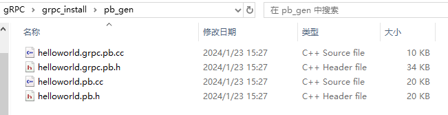

# proto文件生成c代码

## 目录

-   [1. 将.proto文件放到bin目录下](#1-将proto文件放到bin目录下)
-   [2. 新建生成文件夹](#2-新建生成文件夹)
-   [3. 对message进行翻译（翻译成c++代码）](#3-对message进行翻译翻译成c代码)
-   [4. 对service进行翻译（翻译成c++代码）](#4-对service进行翻译翻译成c代码)
-   [5. 生成文件](#5-生成文件)

# 1. 将.proto文件放到bin目录下


# 2. 新建生成文件夹

新建生成文件的文件夹pb\_gen，即生成文件保存的位置


# 3. 对message进行翻译（翻译成c++代码）

在bin目录下打开cmd，执行以下命令

```纯文本
protoc.exe -I=. --cpp_out=..\pb_gen helloworld.proto
```

-I后面的路径为.proto文件所在的路径

—cpp\_out后面的路径为生成文件的位置

注意：Linux下不要带.exe后缀

# 4. 对service进行翻译（翻译成c++代码）

在bin目录下打开cmd，执行以下命令

```纯文本
protoc.exe -I=. --grpc_out=..\pb_gen --plugin=protoc-gen-grpc=.\grpc_cpp_plugin.exe helloworld.proto
```

-I后面的路径为.proto文件所在的路径

—cpp\_out后面的路径为生成文件的位置

\--plugin=protoc-gen-grpc后面的路径为grpc\_cpp\_plugin.exe的路径（将grpc转为cpp的插件）

注意：Linux下不要带.exe后缀

# 5. 生成文件

得到以下4个文件


