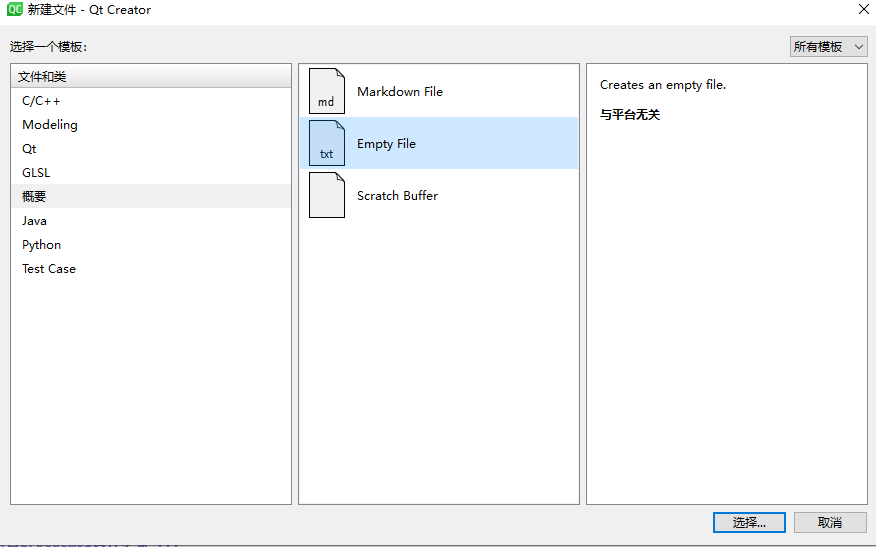
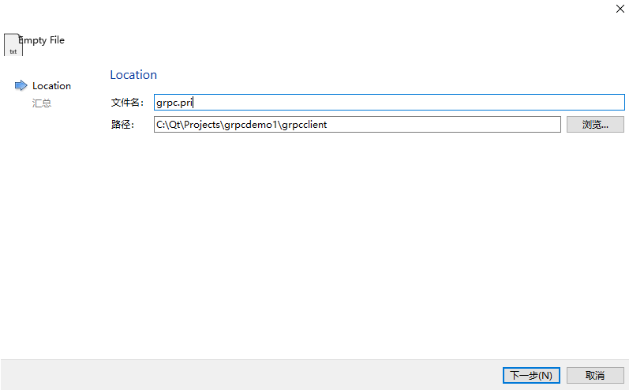
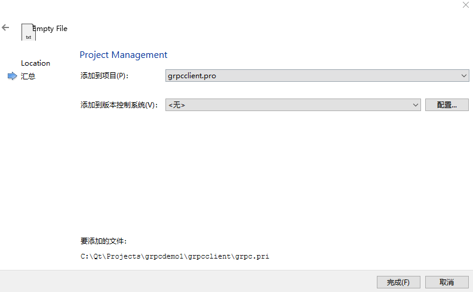
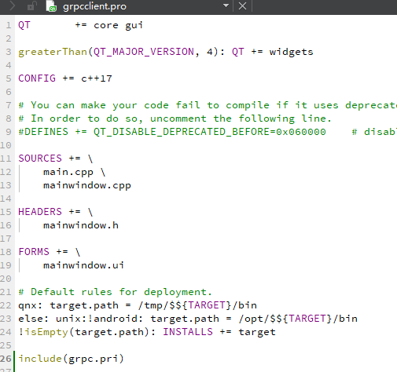
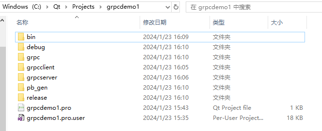
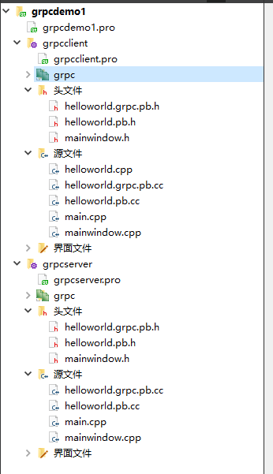
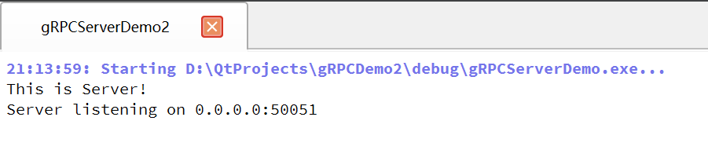
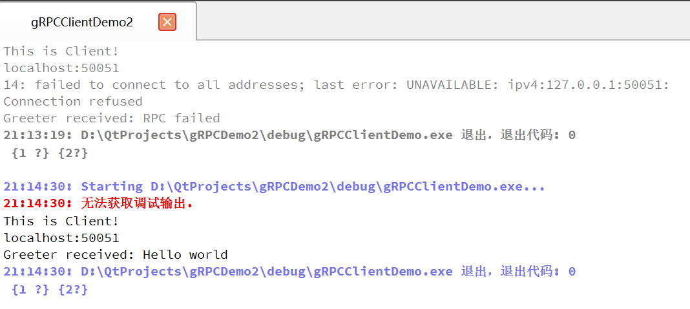

# 导入gRPC库

## 目录

-   [1. 客户端Client/服务端Server](#1-客户端Client服务端Server)
    -   [1.1 新建.pri文件](#11-新建pri文件)
    -   [1.2 编写.pri配置](#12-编写pri配置)
        -   [1.2.1 设置debug和release的输出目录](#121-设置debug和release的输出目录)
        -   [1.2.2 将grpc\_install复制到根目录下](#122-将grpc_install复制到根目录下)
        -   [1.2.3 引入gRPC头文件](#123-引入gRPC头文件)
        -   [1.2.4 引入gRPC静态库](#124-引入gRPC静态库)
        -   [1.2.5 踩坑](#125-踩坑)
        -   [1.2.6 文件总览](#126-文件总览)
    -   [1.3 使用helloworld例子](#13-使用helloworld例子)
        -   [1.3.1 Client](#131-Client)
        -   [1.3.2 Server](#132-Server)
        -   [1.3.3 结果](#133-结果)

# 1. 客户端Client/服务端Server

## 1.1 新建.pri文件







在grpcclient.pro中引入新建的grpc.pri文件，并删除默认在DISTFILES下生成的语句



## 1.2 编写.pri配置

### 1.2.1 设置debug和release的输出目录

```纯文本
CONFIG(debug,debug|release){
    DESTDIR += $$PWD/../debug
}else{
    DESTDIR += $$PWD/../release
}
```

### 1.2.2 将grpc\_install复制到根目录下

&#x20;   将grpc\_install中的所有文件复制到项目的根目录下



### 1.2.3 引入gRPC头文件

```纯文本
INCLUDEPATH += $$PWD/../grpc

```

### 1.2.4 引入gRPC静态库

注意，只引入以.lib结尾的

```纯文本
LIBS += -L$$PWD/../debug -labsl_bad_any_cast_impl
```

-L后面跟路径

-l后面跟文件名，不要后缀

小技巧：

&#x20;   由于静态库数量十分庞大，将文件名提取到.txt文件中，然后copy过去

&#x20;   在静态库文件夹debug下打开cmd，并输入

```纯文本
dir /b | findstr .lib > 1.txt
```

同理，在release下引入release的静态库，复制debug的即可，改一下路径，需要注意，debug和release的静态库略有差异

```纯文本
LIBS += -L$$PWD/../release -labsl_bad_any_cast_impl
```

### 1.2.5 踩坑

在使用debug的静态库时，会有几个动态库混入其中，导致程序不能运行，需将其删除，如下：

```纯文本
zlib.lib
zlibstatic.lib
libprotoc.lib
libprotobuf.lib  尤其是这个
libprotobuf-lite.lib 尤其是这个

```

同理，release下删除上述对应的debug版，如下：

```纯文本
zlibd.lib
zlibstaticd.lib
libprotocd.lib
libprotobufd.lib
libprotobuf-lited.lib

```

### 1.2.6 文件总览

```纯文本
//.pri
CONFIG(debug,debug|release){
    DESTDIR += $$PWD/../debug
    INCLUDEPATH += $$PWD/../grpc_install_debug/grpc

    LIBS += -L$$PWD/../grpc_install_debug/debug -labsl_bad_any_cast_impl
    LIBS += -L$$PWD/../grpc_install_debug/debug -labsl_bad_optional_access
    LIBS += -L$$PWD/../grpc_install_debug/debug -labsl_bad_variant_access
    LIBS += -L$$PWD/../grpc_install_debug/debug -labsl_base
    LIBS += -L$$PWD/../grpc_install_debug/debug -labsl_city
    LIBS += -L$$PWD/../grpc_install_debug/debug -labsl_civil_time
    LIBS += -L$$PWD/../grpc_install_debug/debug -labsl_cord
    LIBS += -L$$PWD/../grpc_install_debug/debug -labsl_cordz_functions
    LIBS += -L$$PWD/../grpc_install_debug/debug -labsl_cordz_handle
    LIBS += -L$$PWD/../grpc_install_debug/debug -labsl_cordz_info
    LIBS += -L$$PWD/../grpc_install_debug/debug -labsl_cordz_sample_token
    LIBS += -L$$PWD/../grpc_install_debug/debug -labsl_cord_internal
    LIBS += -L$$PWD/../grpc_install_debug/debug -labsl_crc32c
    LIBS += -L$$PWD/../grpc_install_debug/debug -labsl_crc_cord_state
    LIBS += -L$$PWD/../grpc_install_debug/debug -labsl_crc_cpu_detect
    LIBS += -L$$PWD/../grpc_install_debug/debug -labsl_crc_internal
    LIBS += -L$$PWD/../grpc_install_debug/debug -labsl_debugging_internal
    LIBS += -L$$PWD/../grpc_install_debug/debug -labsl_demangle_internal
    LIBS += -L$$PWD/../grpc_install_debug/debug -labsl_die_if_null
    LIBS += -L$$PWD/../grpc_install_debug/debug -labsl_examine_stack
    LIBS += -L$$PWD/../grpc_install_debug/debug -labsl_exponential_biased
    LIBS += -L$$PWD/../grpc_install_debug/debug -labsl_failure_signal_handler
    LIBS += -L$$PWD/../grpc_install_debug/debug -labsl_flags
    LIBS += -L$$PWD/../grpc_install_debug/debug -labsl_flags_commandlineflag
    LIBS += -L$$PWD/../grpc_install_debug/debug -labsl_flags_commandlineflag_internal
    LIBS += -L$$PWD/../grpc_install_debug/debug -labsl_flags_config
    LIBS += -L$$PWD/../grpc_install_debug/debug -labsl_flags_internal
    LIBS += -L$$PWD/../grpc_install_debug/debug -labsl_flags_marshalling
    LIBS += -L$$PWD/../grpc_install_debug/debug -labsl_flags_parse
    LIBS += -L$$PWD/../grpc_install_debug/debug -labsl_flags_private_handle_accessor
    LIBS += -L$$PWD/../grpc_install_debug/debug -labsl_flags_program_name
    LIBS += -L$$PWD/../grpc_install_debug/debug -labsl_flags_reflection
    LIBS += -L$$PWD/../grpc_install_debug/debug -labsl_flags_usage
    LIBS += -L$$PWD/../grpc_install_debug/debug -labsl_flags_usage_internal
    LIBS += -L$$PWD/../grpc_install_debug/debug -labsl_graphcycles_internal
    LIBS += -L$$PWD/../grpc_install_debug/debug -labsl_hash
    LIBS += -L$$PWD/../grpc_install_debug/debug -labsl_hashtablez_sampler
    LIBS += -L$$PWD/../grpc_install_debug/debug -labsl_int128
    LIBS += -L$$PWD/../grpc_install_debug/debug -labsl_kernel_timeout_internal
    LIBS += -L$$PWD/../grpc_install_debug/debug -labsl_leak_check
    LIBS += -L$$PWD/../grpc_install_debug/debug -labsl_log_entry
    LIBS += -L$$PWD/../grpc_install_debug/debug -labsl_log_flags
    LIBS += -L$$PWD/../grpc_install_debug/debug -labsl_log_globals
    LIBS += -L$$PWD/../grpc_install_debug/debug -labsl_log_initialize
    LIBS += -L$$PWD/../grpc_install_debug/debug -labsl_log_internal_check_op
    LIBS += -L$$PWD/../grpc_install_debug/debug -labsl_log_internal_conditions
    LIBS += -L$$PWD/../grpc_install_debug/debug -labsl_log_internal_format
    LIBS += -L$$PWD/../grpc_install_debug/debug -labsl_log_internal_globals
    LIBS += -L$$PWD/../grpc_install_debug/debug -labsl_log_internal_log_sink_set
    LIBS += -L$$PWD/../grpc_install_debug/debug -labsl_log_internal_message
    LIBS += -L$$PWD/../grpc_install_debug/debug -labsl_log_internal_nullguard
    LIBS += -L$$PWD/../grpc_install_debug/debug -labsl_log_internal_proto
    LIBS += -L$$PWD/../grpc_install_debug/debug -labsl_log_severity
    LIBS += -L$$PWD/../grpc_install_debug/debug -labsl_log_sink
    LIBS += -L$$PWD/../grpc_install_debug/debug -labsl_low_level_hash
    LIBS += -L$$PWD/../grpc_install_debug/debug -labsl_malloc_internal
    LIBS += -L$$PWD/../grpc_install_debug/debug -labsl_periodic_sampler
    LIBS += -L$$PWD/../grpc_install_debug/debug -labsl_random_distributions
    LIBS += -L$$PWD/../grpc_install_debug/debug -labsl_random_internal_distribution_test_util
    LIBS += -L$$PWD/../grpc_install_debug/debug -labsl_random_internal_platform
    LIBS += -L$$PWD/../grpc_install_debug/debug -labsl_random_internal_pool_urbg
    LIBS += -L$$PWD/../grpc_install_debug/debug -labsl_random_internal_randen
    LIBS += -L$$PWD/../grpc_install_debug/debug -labsl_random_internal_randen_hwaes
    LIBS += -L$$PWD/../grpc_install_debug/debug -labsl_random_internal_randen_hwaes_impl
    LIBS += -L$$PWD/../grpc_install_debug/debug -labsl_random_internal_randen_slow
    LIBS += -L$$PWD/../grpc_install_debug/debug -labsl_random_internal_seed_material
    LIBS += -L$$PWD/../grpc_install_debug/debug -labsl_random_seed_gen_exception
    LIBS += -L$$PWD/../grpc_install_debug/debug -labsl_random_seed_sequences
    LIBS += -L$$PWD/../grpc_install_debug/debug -labsl_raw_hash_set
    LIBS += -L$$PWD/../grpc_install_debug/debug -labsl_raw_logging_internal
    LIBS += -L$$PWD/../grpc_install_debug/debug -labsl_scoped_set_env
    LIBS += -L$$PWD/../grpc_install_debug/debug -labsl_spinlock_wait
    LIBS += -L$$PWD/../grpc_install_debug/debug -labsl_stacktrace
    LIBS += -L$$PWD/../grpc_install_debug/debug -labsl_status
    LIBS += -L$$PWD/../grpc_install_debug/debug -labsl_statusor
    LIBS += -L$$PWD/../grpc_install_debug/debug -labsl_strerror
    LIBS += -L$$PWD/../grpc_install_debug/debug -labsl_strings
    LIBS += -L$$PWD/../grpc_install_debug/debug -labsl_strings_internal
    LIBS += -L$$PWD/../grpc_install_debug/debug -labsl_string_view
    LIBS += -L$$PWD/../grpc_install_debug/debug -labsl_str_format_internal
    LIBS += -L$$PWD/../grpc_install_debug/debug -labsl_symbolize
    LIBS += -L$$PWD/../grpc_install_debug/debug -labsl_synchronization
    LIBS += -L$$PWD/../grpc_install_debug/debug -labsl_throw_delegate
    LIBS += -L$$PWD/../grpc_install_debug/debug -labsl_time
    LIBS += -L$$PWD/../grpc_install_debug/debug -labsl_time_zone
    LIBS += -L$$PWD/../grpc_install_debug/debug -laddress_sorting
    LIBS += -L$$PWD/../grpc_install_debug/debug -lcares
    LIBS += -L$$PWD/../grpc_install_debug/debug -lcrypto
    LIBS += -L$$PWD/../grpc_install_debug/debug -lgpr
    LIBS += -L$$PWD/../grpc_install_debug/debug -lgrpc++
    LIBS += -L$$PWD/../grpc_install_debug/debug -lgrpc++_alts
    LIBS += -L$$PWD/../grpc_install_debug/debug -lgrpc++_error_details
    LIBS += -L$$PWD/../grpc_install_debug/debug -lgrpc++_reflection
    LIBS += -L$$PWD/../grpc_install_debug/debug -lgrpc++_unsecure
    LIBS += -L$$PWD/../grpc_install_debug/debug -lgrpc
    LIBS += -L$$PWD/../grpc_install_debug/debug -lgrpcpp_channelz
    LIBS += -L$$PWD/../grpc_install_debug/debug -lgrpc_authorization_provider
    LIBS += -L$$PWD/../grpc_install_debug/debug -lgrpc_plugin_support
    LIBS += -L$$PWD/../grpc_install_debug/debug -lgrpc_unsecure
    LIBS += -L$$PWD/../grpc_install_debug/debug -llibprotobuf-lited
    LIBS += -L$$PWD/../grpc_install_debug/debug -llibprotobufd
    LIBS += -L$$PWD/../grpc_install_debug/debug -llibprotocd
    LIBS += -L$$PWD/../grpc_install_debug/debug -lre2
    LIBS += -L$$PWD/../grpc_install_debug/debug -lssl
    LIBS += -L$$PWD/../grpc_install_debug/debug -lupb
    LIBS += -L$$PWD/../grpc_install_debug/debug -lupb_collections_lib
    LIBS += -L$$PWD/../grpc_install_debug/debug -lupb_json_lib
    LIBS += -L$$PWD/../grpc_install_debug/debug -lupb_textformat_lib
    LIBS += -L$$PWD/../grpc_install_debug/debug -lutf8_range
    LIBS += -L$$PWD/../grpc_install_debug/debug -lutf8_range_lib
    LIBS += -L$$PWD/../grpc_install_debug/debug -lutf8_validity
    LIBS += -L$$PWD/../grpc_install_debug/debug -lzlibd
    LIBS += -L$$PWD/../grpc_install_debug/debug -lzlibstaticd
}else{
    DESTDIR += $$PWD/../release
    INCLUDEPATH += $$PWD/../grpc_install_release/grpc

    LIBS += -L$$PWD/../grpc_install_release/release -labsl_bad_any_cast_impl
    LIBS += -L$$PWD/../grpc_install_release/release -labsl_bad_optional_access
    LIBS += -L$$PWD/../grpc_install_release/release -labsl_bad_variant_access
    LIBS += -L$$PWD/../grpc_install_release/release -labsl_base
    LIBS += -L$$PWD/../grpc_install_release/release -labsl_city
    LIBS += -L$$PWD/../grpc_install_release/release -labsl_civil_time
    LIBS += -L$$PWD/../grpc_install_release/release -labsl_cord
    LIBS += -L$$PWD/../grpc_install_release/release -labsl_cordz_functions
    LIBS += -L$$PWD/../grpc_install_release/release -labsl_cordz_handle
    LIBS += -L$$PWD/../grpc_install_release/release -labsl_cordz_info
    LIBS += -L$$PWD/../grpc_install_release/release -labsl_cordz_sample_token
    LIBS += -L$$PWD/../grpc_install_release/release -labsl_cord_internal
    LIBS += -L$$PWD/../grpc_install_release/release -labsl_crc32c
    LIBS += -L$$PWD/../grpc_install_release/release -labsl_crc_cord_state
    LIBS += -L$$PWD/../grpc_install_release/release -labsl_crc_cpu_detect
    LIBS += -L$$PWD/../grpc_install_release/release -labsl_crc_internal
    LIBS += -L$$PWD/../grpc_install_release/release -labsl_debugging_internal
    LIBS += -L$$PWD/../grpc_install_release/release -labsl_demangle_internal
    LIBS += -L$$PWD/../grpc_install_release/release -labsl_die_if_null
    LIBS += -L$$PWD/../grpc_install_release/release -labsl_examine_stack
    LIBS += -L$$PWD/../grpc_install_release/release -labsl_exponential_biased
    LIBS += -L$$PWD/../grpc_install_release/release -labsl_failure_signal_handler
    LIBS += -L$$PWD/../grpc_install_release/release -labsl_flags
    LIBS += -L$$PWD/../grpc_install_release/release -labsl_flags_commandlineflag
    LIBS += -L$$PWD/../grpc_install_release/release -labsl_flags_commandlineflag_internal
    LIBS += -L$$PWD/../grpc_install_release/release -labsl_flags_config
    LIBS += -L$$PWD/../grpc_install_release/release -labsl_flags_internal
    LIBS += -L$$PWD/../grpc_install_release/release -labsl_flags_marshalling
    LIBS += -L$$PWD/../grpc_install_release/release -labsl_flags_parse
    LIBS += -L$$PWD/../grpc_install_release/release -labsl_flags_private_handle_accessor
    LIBS += -L$$PWD/../grpc_install_release/release -labsl_flags_program_name
    LIBS += -L$$PWD/../grpc_install_release/release -labsl_flags_reflection
    LIBS += -L$$PWD/../grpc_install_release/release -labsl_flags_usage
    LIBS += -L$$PWD/../grpc_install_release/release -labsl_flags_usage_internal
    LIBS += -L$$PWD/../grpc_install_release/release -labsl_graphcycles_internal
    LIBS += -L$$PWD/../grpc_install_release/release -labsl_hash
    LIBS += -L$$PWD/../grpc_install_release/release -labsl_hashtablez_sampler
    LIBS += -L$$PWD/../grpc_install_release/release -labsl_int128
    LIBS += -L$$PWD/../grpc_install_release/release -labsl_kernel_timeout_internal
    LIBS += -L$$PWD/../grpc_install_release/release -labsl_leak_check
    LIBS += -L$$PWD/../grpc_install_release/release -labsl_log_entry
    LIBS += -L$$PWD/../grpc_install_release/release -labsl_log_flags
    LIBS += -L$$PWD/../grpc_install_release/release -labsl_log_globals
    LIBS += -L$$PWD/../grpc_install_release/release -labsl_log_initialize
    LIBS += -L$$PWD/../grpc_install_release/release -labsl_log_internal_check_op
    LIBS += -L$$PWD/../grpc_install_release/release -labsl_log_internal_conditions
    LIBS += -L$$PWD/../grpc_install_release/release -labsl_log_internal_format
    LIBS += -L$$PWD/../grpc_install_release/release -labsl_log_internal_globals
    LIBS += -L$$PWD/../grpc_install_release/release -labsl_log_internal_log_sink_set
    LIBS += -L$$PWD/../grpc_install_release/release -labsl_log_internal_message
    LIBS += -L$$PWD/../grpc_install_release/release -labsl_log_internal_nullguard
    LIBS += -L$$PWD/../grpc_install_release/release -labsl_log_internal_proto
    LIBS += -L$$PWD/../grpc_install_release/release -labsl_log_severity
    LIBS += -L$$PWD/../grpc_install_release/release -labsl_log_sink
    LIBS += -L$$PWD/../grpc_install_release/release -labsl_low_level_hash
    LIBS += -L$$PWD/../grpc_install_release/release -labsl_malloc_internal
    LIBS += -L$$PWD/../grpc_install_release/release -labsl_periodic_sampler
    LIBS += -L$$PWD/../grpc_install_release/release -labsl_random_distributions
    LIBS += -L$$PWD/../grpc_install_release/release -labsl_random_internal_distribution_test_util
    LIBS += -L$$PWD/../grpc_install_release/release -labsl_random_internal_platform
    LIBS += -L$$PWD/../grpc_install_release/release -labsl_random_internal_pool_urbg
    LIBS += -L$$PWD/../grpc_install_release/release -labsl_random_internal_randen
    LIBS += -L$$PWD/../grpc_install_release/release -labsl_random_internal_randen_hwaes
    LIBS += -L$$PWD/../grpc_install_release/release -labsl_random_internal_randen_hwaes_impl
    LIBS += -L$$PWD/../grpc_install_release/release -labsl_random_internal_randen_slow
    LIBS += -L$$PWD/../grpc_install_release/release -labsl_random_internal_seed_material
    LIBS += -L$$PWD/../grpc_install_release/release -labsl_random_seed_gen_exception
    LIBS += -L$$PWD/../grpc_install_release/release -labsl_random_seed_sequences
    LIBS += -L$$PWD/../grpc_install_release/release -labsl_raw_hash_set
    LIBS += -L$$PWD/../grpc_install_release/release -labsl_raw_logging_internal
    LIBS += -L$$PWD/../grpc_install_release/release -labsl_scoped_set_env
    LIBS += -L$$PWD/../grpc_install_release/release -labsl_spinlock_wait
    LIBS += -L$$PWD/../grpc_install_release/release -labsl_stacktrace
    LIBS += -L$$PWD/../grpc_install_release/release -labsl_status
    LIBS += -L$$PWD/../grpc_install_release/release -labsl_statusor
    LIBS += -L$$PWD/../grpc_install_release/release -labsl_strerror
    LIBS += -L$$PWD/../grpc_install_release/release -labsl_strings
    LIBS += -L$$PWD/../grpc_install_release/release -labsl_strings_internal
    LIBS += -L$$PWD/../grpc_install_release/release -labsl_string_view
    LIBS += -L$$PWD/../grpc_install_release/release -labsl_str_format_internal
    LIBS += -L$$PWD/../grpc_install_release/release -labsl_symbolize
    LIBS += -L$$PWD/../grpc_install_release/release -labsl_synchronization
    LIBS += -L$$PWD/../grpc_install_release/release -labsl_throw_delegate
    LIBS += -L$$PWD/../grpc_install_release/release -labsl_time
    LIBS += -L$$PWD/../grpc_install_release/release -labsl_time_zone
    LIBS += -L$$PWD/../grpc_install_release/release -laddress_sorting
    LIBS += -L$$PWD/../grpc_install_release/release -lcares
    LIBS += -L$$PWD/../grpc_install_release/release -lcrypto
    LIBS += -L$$PWD/../grpc_install_release/release -lgpr
    LIBS += -L$$PWD/../grpc_install_release/release -lgrpc++
    LIBS += -L$$PWD/../grpc_install_release/release -lgrpc++_alts
    LIBS += -L$$PWD/../grpc_install_release/release -lgrpc++_error_details
    LIBS += -L$$PWD/../grpc_install_release/release -lgrpc++_reflection
    LIBS += -L$$PWD/../grpc_install_release/release -lgrpc++_unsecure
    LIBS += -L$$PWD/../grpc_install_release/release -lgrpc
    LIBS += -L$$PWD/../grpc_install_release/release -lgrpcpp_channelz
    LIBS += -L$$PWD/../grpc_install_release/release -lgrpc_authorization_provider
    LIBS += -L$$PWD/../grpc_install_release/release -lgrpc_plugin_support
    LIBS += -L$$PWD/../grpc_install_release/release -lgrpc_unsecure
    LIBS += -L$$PWD/../grpc_install_release/release -llibprotobuf-lite
    LIBS += -L$$PWD/../grpc_install_release/release -llibprotobuf
    LIBS += -L$$PWD/../grpc_install_release/release -llibprotoc
    LIBS += -L$$PWD/../grpc_install_release/release -lre2
    LIBS += -L$$PWD/../grpc_install_release/release -lssl
    LIBS += -L$$PWD/../grpc_install_release/release -lupb
    LIBS += -L$$PWD/../grpc_install_release/release -lupb_collections_lib
    LIBS += -L$$PWD/../grpc_install_release/release -lupb_json_lib
    LIBS += -L$$PWD/../grpc_install_release/release -lupb_textformat_lib
    LIBS += -L$$PWD/../grpc_install_release/release -lutf8_range
    LIBS += -L$$PWD/../grpc_install_release/release -lutf8_range_lib
    LIBS += -L$$PWD/../grpc_install_release/release -lutf8_validity
    LIBS += -L$$PWD/../grpc_install_release/release -lzlib
    LIBS += -L$$PWD/../grpc_install_release/release -lzlibstatic
}

```

```纯文本
//.pro
QT = core

CONFIG += c++17 cmdline

# You can make your code fail to compile if it uses deprecated APIs.
# In order to do so, uncomment the following line.
#DEFINES += QT_DISABLE_DEPRECATED_BEFORE=0x060000    # disables all the APIs deprecated before Qt 6.0.0
include(grpc.pri)

SOURCES += \
        main.cpp \

CONFIG(debug,debug|release){
    INCLUDEPATH += $$PWD/../grpc_install_debug/pb_gen

    SOURCES += \
        $$PWD/../grpc_install_debug/pb_gen/helloworld.grpc.pb.cc \
        $$PWD/../grpc_install_debug/pb_gen/helloworld.pb.cc \

    HEADERS += \
        $$PWD/../grpc_install_debug/pb_gen/helloworld.grpc.pb.h \
        $$PWD/../grpc_install_debug/pb_gen/helloworld.pb.h \
}else{
    INCLUDEPATH += $$PWD/../grpc_install_release/pb_gen

    SOURCES += \
        $$PWD/../grpc_install_release/pb_gen/helloworld.grpc.pb.cc \
        $$PWD/../grpc_install_release/pb_gen/helloworld.pb.cc \

    HEADERS += \
        $$PWD/../grpc_install_release/pb_gen/helloworld.grpc.pb.h \
        $$PWD/../grpc_install_release/pb_gen/helloworld.pb.h \
}
# Default rules for deployment.
qnx: target.path = /tmp/$${TARGET}/bin
else: unix:!android: target.path = /opt/$${TARGET}/bin
!isEmpty(target.path): INSTALLS += target

```

## 1.3 使用helloworld例子

新建helloworld.cpp文件，将grpc源码example/cpp/helloworld中greeter\_client.cc的内容复制进去

将pb\_gen中的4个文件copy到客户端Client的根目录下，并在项目中添加现有文件导入



### 1.3.1 Client

将grpcclient的main函数换成如下代码：

```纯文本
/*
 *
 * Copyright 2015 gRPC authors.
 *
 * Licensed under the Apache License, Version 2.0 (the "License");
 * you may not use this file except in compliance with the License.
 * You may obtain a copy of the License at
 *
 *     http://www.apache.org/licenses/LICENSE-2.0
 *
 * Unless required by applicable law or agreed to in writing, software
 * distributed under the License is distributed on an "AS IS" BASIS,
 * WITHOUT WARRANTIES OR CONDITIONS OF ANY KIND, either express or implied.
 * See the License for the specific language governing permissions and
 * limitations under the License.
 *
 */

#include <iostream>
#include <memory>
#include <string>

#include "absl/flags/flag.h"
#include "absl/flags/parse.h"

#include <grpcpp/grpcpp.h>

#ifdef BAZEL_BUILD
#include "examples/protos/helloworld.grpc.pb.h"
#else
#include "helloworld.grpc.pb.h"
#endif

ABSL_FLAG(std::string, target, "localhost:50051", "Server address");

using grpc::Channel;
using grpc::ClientContext;
using grpc::Status;
using helloworld::Greeter;
using helloworld::HelloReply;
using helloworld::HelloRequest;

class GreeterClient {
 public:
  GreeterClient(std::shared_ptr<Channel> channel)
      : stub_(Greeter::NewStub(channel)) {}

  // Assembles the client's payload, sends it and presents the response back
  // from the server.
  std::string SayHello(const std::string& user) {
    // Data we are sending to the server.
    HelloRequest request;
    request.set_name(user);

    // Container for the data we expect from the server.
    HelloReply reply;

    // Context for the client. It could be used to convey extra information to
    // the server and/or tweak certain RPC behaviors.
    ClientContext context;

    // The actual RPC.
    Status status = stub_->SayHello(&context, request, &reply);

    // Act upon its status.
    if (status.ok()) {
      return reply.message();
    } else {
      std::cout << status.error_code() << ": " << status.error_message()
                << std::endl;
      return "RPC failed";
    }
  }

 private:
  std::unique_ptr<Greeter::Stub> stub_;
};

int main(int argc, char** argv) {
  absl::ParseCommandLine(argc, argv);
  // Instantiate the client. It requires a channel, out of which the actual RPCs
  // are created. This channel models a connection to an endpoint specified by
  // the argument "--target=" which is the only expected argument.
  std::string target_str = absl::GetFlag(FLAGS_target);
  // We indicate that the channel isn't authenticated (use of
  // InsecureChannelCredentials()).
  GreeterClient greeter(
      grpc::CreateChannel(target_str, grpc::InsecureChannelCredentials()));
  std::string user("world");
  std::string reply = greeter.SayHello(user);
  std::cout << "Greeter received: " << reply << std::endl;

  return 0;
}

```

### 1.3.2 Server

将grpcserver的main函数换成如下代码：

```纯文本
/*
 *
 * Copyright 2015 gRPC authors.
 *
 * Licensed under the Apache License, Version 2.0 (the "License");
 * you may not use this file except in compliance with the License.
 * You may obtain a copy of the License at
 *
 *     http://www.apache.org/licenses/LICENSE-2.0
 *
 * Unless required by applicable law or agreed to in writing, software
 * distributed under the License is distributed on an "AS IS" BASIS,
 * WITHOUT WARRANTIES OR CONDITIONS OF ANY KIND, either express or implied.
 * See the License for the specific language governing permissions and
 * limitations under the License.
 *
 */

#include <iostream>
#include <memory>
#include <string>

#include "absl/flags/flag.h"
#include "absl/flags/parse.h"
#include "absl/strings/str_format.h"

#include <grpcpp/ext/proto_server_reflection_plugin.h>
#include <grpcpp/grpcpp.h>
#include <grpcpp/health_check_service_interface.h>

#ifdef BAZEL_BUILD
#include "examples/protos/helloworld.grpc.pb.h"
#else
#include "helloworld.grpc.pb.h"
#endif

using grpc::Server;
using grpc::ServerBuilder;
using grpc::ServerContext;
using grpc::Status;
using helloworld::Greeter;
using helloworld::HelloReply;
using helloworld::HelloRequest;

ABSL_FLAG(uint16_t, port, 50051, "Server port for the service");

// Logic and data behind the server's behavior.
class GreeterServiceImpl final : public Greeter::Service {
  Status SayHello(ServerContext* context, const HelloRequest* request,
                  HelloReply* reply) override {
    std::string prefix("Hello ");
    reply->set_message(prefix + request->name());
    return Status::OK;
  }
};

void RunServer(uint16_t port) {
  std::string server_address = absl::StrFormat("0.0.0.0:%d", port);
  GreeterServiceImpl service;

  grpc::EnableDefaultHealthCheckService(true);
  grpc::reflection::InitProtoReflectionServerBuilderPlugin();
  ServerBuilder builder;
  // Listen on the given address without any authentication mechanism.
  builder.AddListeningPort(server_address, grpc::InsecureServerCredentials());
  // Register "service" as the instance through which we'll communicate with
  // clients. In this case it corresponds to an *synchronous* service.
  builder.RegisterService(&service);
  // Finally assemble the server.
  std::unique_ptr<Server> server(builder.BuildAndStart());
  std::cout << "Server listening on " << server_address << std::endl;

  // Wait for the server to shutdown. Note that some other thread must be
  // responsible for shutting down the server for this call to ever return.
  server->Wait();
}

int main(int argc, char** argv) {
  absl::ParseCommandLine(argc, argv);
  RunServer(absl::GetFlag(FLAGS_port));
  return 0;
}

```

### 1.3.3 结果




