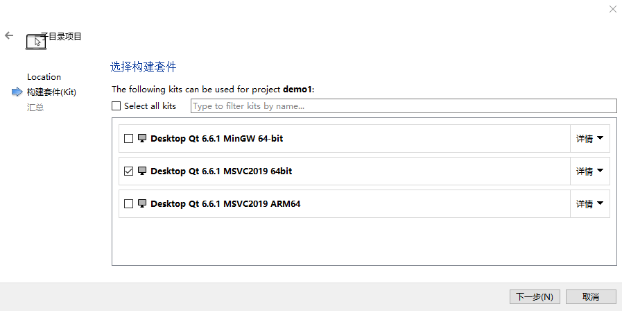

# 新建项目

## 目录

-   [1. 新建项目目录](#1-新建项目目录)
-   [2. 新建client子项目](#2-新建client子项目)
-   [3. 新建server子项目](#3-新建server子项目)
-   [4. 项目结构](#4-项目结构)

# 1. 新建项目目录

选择MSVC2019

# 2. 新建client子项目

使用qmake

选择MSVC2019

# 3. 新建server子项目

使用qmake

选择MSVC2019

# 4. 项目结构

